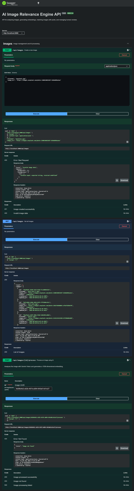

# AI Image Relevance Engine

An AI-powered backend service that analyzes images, generates embeddings, compares images with post content, and recommends relevant images using semantic similarity. The system also supports automated image processing, scheduled processing, AI cost tracking, and human review of image suggestions.

## Project Overview

The **AI Image Relevance Engine** is designed to solve the problem of selecting relevant images for written posts.

The application:

1. Creates posts and generates text embeddings.
2. Stores image information and processes images using AI.
3. Generates image embeddings and AI-generated image metadata.
4. Compares post embeddings with image embeddings using cosine similarity.
5. Classifies matches as `accepted`, `review`, or `rejected`.
6. Stores image suggestions in PostgreSQL.
7. Allows a human reviewer to accept or reject suggestions.
8. Tracks AI operations and estimated costs.
9. Supports scheduled image processing.
10. Provides interactive API documentation through Swagger UI.

## Architecture

```text
                    ┌──────────────────────┐
                    │      Client/API      │
                    └──────────┬───────────┘
                               │
                               ▼
                    ┌──────────────────────┐
                    │   Express.js API     │
                    └──────────┬───────────┘
                               │
             ┌─────────────────┼─────────────────┐
             │                 │                 │
             ▼                 ▼                 ▼
       Posts Service      Images Service    Review Service
             │                 │                 │
             ▼                 ▼                 ▼
       Text Embedding     Gemini Vision      Human Review
             │             + Embedding             │
             └────────────────┬────────────────────┘
                              ▼
                    ┌──────────────────────┐
                    │ Matching Service     │
                    │ Cosine Similarity    │
                    └──────────┬───────────┘
                               │
                               ▼
                    ┌──────────────────────┐
                    │     PostgreSQL       │
                    │ posts / images /     │
                    │ vectors / suggestions│
                    │ reviews / cost logs  │
                    └──────────────────────┘
```

## Main Features

### 1. Post Management

- Create posts with a title and content.
- Generate an embedding for each post.
- Store post embeddings for semantic matching.
- Retrieve all posts.

### 2. Image Management

- Create image records using an image URL.
- Retrieve stored images.
- Process images using AI.
- Generate image metadata and embeddings.
- Track image processing status.

### 3. AI Image Matching and Mismatch Guard

The matching service compares post embeddings with image embeddings using cosine similarity.

A subject mismatch guard is applied after similarity ranking to prevent semantically incorrect matches from being accepted simply because their embedding similarity is high.

For example:

```text
Post: Red fox wildlife photography

Fox image       -> relevant
Forest image    -> rejected: subject mismatch
Dog image       -> rejected: subject mismatch
Mountain image  -> rejected: subject mismatch

The current decision thresholds are:

| Similarity | Decision |
|---|---|
| `>= 0.80` | accepted |
| `0.60 - 0.79` | review |
| `< 0.60` | rejected |

The thresholds can be adjusted as the system is tuned.

### 4. Human Review Workflow

Images with moderate similarity can be manually reviewed.

A reviewer can submit:

- `accepted`
- `rejected`

along with an optional comment.

Example workflow:

```text
AI Matching
     │
     ▼
Suggestion: review
     │
     ▼
Human Reviewer
     │
 ┌───┴────┐
 ▼        ▼
Accept   Reject
```
### 5. Automatic Retry and Failure Handling

Image processing runs through a background job.

The processor supports:

- Maximum of 3 processing attempts.
- Failed images are automatically retried.
- Exponential backoff between attempts:
  - 1st failure → retry after 1 minute
  - 2nd failure → retry after 2 minutes
- After the maximum attempts are reached, the image remains `failed`.
- Gemini rate-limit errors such as HTTP 429 are handled by the retry mechanism.
- New images remain `pending` until picked up by the scheduled processor.

This prevents temporary AI/API failures from permanently failing image processing.

### 6. Scheduled Image Processing

The project includes a scheduled processing job that can automatically process pending images instead of requiring every image to be processed manually.

### 7. AI Cost Tracking

AI operations are logged in the `ai_cost_logs` table.

Tracked operations include:

- `post_embedding`
- `image_embedding`
- `image_vision`

Each log records the model, resource ID, estimated cost, and timestamp.

### 8. Swagger API Documentation

Swagger UI is available locally at:

```text
http://localhost:5000/docs/
```

The API documentation provides an interactive interface for testing the backend endpoints.

## Swagger UI

The following screenshot shows the project's interactive Swagger API documentation:



## API Endpoints

### Health

```http
GET /health
```

Checks whether the backend is running.

### Posts

```http
POST /api/posts
GET  /api/posts
POST /api/posts/:id/match
GET  /api/posts/:id/suggestions
```

- Create a post.
- List posts.
- Match a post with available images.
- Retrieve suggestions for a specific post.

### Images

```http
POST /api/images
GET  /api/images
POST /api/images/:id/process
```

- Create an image record.
- List images.
- Process an image using AI.

### Suggestions

```http
GET /api/suggestions
```

Returns image suggestions generated by the matching workflow.

### Reviews

```http
GET  /api/reviews
POST /api/reviews
```

- Retrieve submitted reviews.
- Submit a human review for a suggestion.

## Example: Create a Post

PowerShell:

```powershell
$body = @{
    title = "Forest Photography"
    content = "A peaceful forest with green trees is ideal for hiking and nature photography."
} | ConvertTo-Json

Invoke-RestMethod `
    -Uri "http://localhost:5000/api/posts" `
    -Method POST `
    -ContentType "application/json" `
    -Body $body
```

Example response:

```json
{
  "message": "Post created successfully",
  "result": {
    "post": {},
    "embedding": {}
  }
}
```

## Example: Match a Post

```powershell
curl.exe -X POST http://localhost:5000/api/posts/<POST_ID>/match
```

The response contains the post and its ranked image matches, including:

- image ID
- filename
- image URL
- similarity score
- decision
- explanation

## Example: Submit a Human Review

PowerShell:

```powershell
$body = @{
    suggestion_id = "<SUGGESTION_ID>"
    decision = "accepted"
    comment = "The image is highly relevant to the post."
} | ConvertTo-Json

Invoke-RestMethod `
    -Uri "http://localhost:5000/api/reviews" `
    -Method POST `
    -ContentType "application/json" `
    -Body $body
```

## Technology Stack

- **Node.js**
- **Express.js**
- **PostgreSQL**
- **pgvector**
- **Google Gemini**
- **Swagger / OpenAPI**
- **Docker**
- **JavaScript**
- **Git & GitHub**

## Project Structure

```text
flyrank-capstone-image-relevance/
│
├── src/
│   ├── config/
│   │   ├── db.js
│   │   └── swagger.js
│   │
│   ├── controllers/
│   ├── routes/
│   ├── services/
│   ├── schemas/
│   └── server.js
│
├── docs/
│   └── swagger.png
│
├── package.json
├── package-lock.json
└── README.md
```

## Setup

### 1. Clone the repository

```bash
git clone https://github.com/Ayush8521/flyrank-capstone-image-relevance.git
cd flyrank-capstone-image-relevance
```

### 2. Install dependencies

```bash
npm install
```

### 3. Configure environment variables

Create a `.env` file and provide the required database and Gemini configuration used by the application.

Example:

```env
PORT=5000
DATABASE_URL=your_postgresql_connection_string
GEMINI_API_KEY=your_gemini_api_key
```

Do not commit real API keys or passwords to GitHub.

### 4. Start PostgreSQL

The project uses PostgreSQL and pgvector. If using the project's Docker setup, start the required containers with the project's Docker configuration.

### 5. Start the server

```bash
npm start
```

The API should be available at:

```text
http://localhost:5000
```

Swagger UI:

```text
http://localhost:5000/docs/
```

## Testing

Useful verification commands:

```powershell
curl.exe http://localhost:5000/health
curl.exe http://localhost:5000/api/posts
curl.exe http://localhost:5000/api/images
curl.exe http://localhost:5000/api/suggestions
curl.exe http://localhost:5000/api/reviews
```

## Database Verification

Example PostgreSQL query:

```powershell
docker exec -it flyrank-postgres psql -U flyrank -d image_relevance
```

AI cost logs can be inspected with:

```sql
SELECT operation, model, resource_id, estimated_cost, created_at
FROM ai_cost_logs
ORDER BY created_at DESC;
```

## Current Workflow

```text
Create Post
    ↓
Generate Post Embedding
    ↓
Create/Store Images
    ↓
Process Images with Gemini
    ↓
Generate Image Embeddings
    ↓
Calculate Semantic Similarity
    ↓
Create Suggestions
    ↓
 ┌───────────────┐
 │ AI Decision   │
 └───────┬───────┘
         │
   ┌─────┼─────┐
   ▼     ▼     ▼
Accepted Review Rejected
         │
         ▼
   Human Review
         │
         ▼
 Final Decision
```

## API Documentation

Interactive API documentation is provided using **Swagger UI**.

Run the application and open:

```text
http://localhost:5000/docs/
```

The Swagger specification is generated from the route documentation in:

```text
src/config/swagger.js
```

## GitHub

Repository:

```text
https://github.com/Ayush8521/flyrank-capstone-image-relevance
```

## Project Status

The backend currently includes:

- [x] PostgreSQL database setup
- [x] Image creation and listing
- [x] Gemini image analysis
- [x] Image embeddings
- [x] Post embeddings
- [x] Semantic image matching
- [x] Suggestion generation
- [x] Suggestion retrieval
- [x] Human review workflow
- [x] Scheduled image processing
- [x] AI cost tracking
- [x] Swagger/OpenAPI documentation
- [x] API verification
